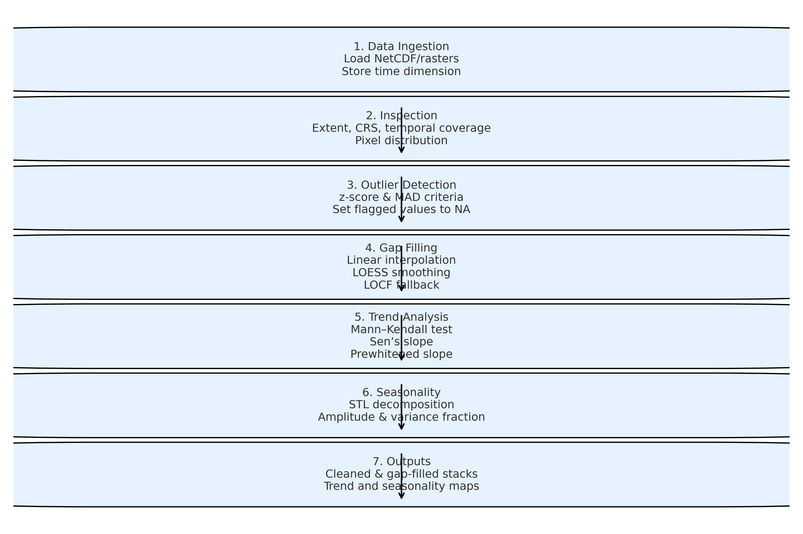

# Copernicus Marine Time Series Analysis

## Workflow for Pixel-wise Analysis of Satellite Image Time Series

The workflow was designed to perform a reproducible and modular analysis of multi-temporal satellite datasets stored as raster stacks or NetCDF files. It is structured into sequential modules that address data preparation, quality control, temporal interpolation, and the extraction of trend and seasonality metrics. All computations are conducted in a pixel-wise manner, ensuring that the temporal trajectory of each spatial unit (pixel) is preserved.

### 1. Data Ingestion and Structuring

The workflow ingests multi-temporal raster data, typically in NetCDF format, through the terra R package. A single variable of interest (e.g., sea surface temperature, chlorophyll concentration) is loaded as a SpatRaster object, with the temporal dimension parsed either from the NetCDF metadata or, if unavailable, stored as an explicit attribute. This structure preserves the full spatial extent and temporal depth of the dataset, allowing subsequent modules to operate on complete per-pixel trajectories.

### 2. Preliminary Inspection

An inspection module summarizes the dataset to provide an overview of its characteristics. This includes raster dimensions (rows, columns, number of layers), geospatial extent, coordinate reference system, and the temporal coverage of the time series. Sampling of pixel values is performed to evaluate data distributions and identify potential anomalies in the input layers prior to more formal quality control.

### 3. Outlier Detection and Removal

Pixel-wise time series are evaluated for spurious values using a hybrid approach combining z-score statistics and robust median absolute deviation (MAD). For each pixel, values exceeding either (i) a standardized deviation threshold from the mean or (ii) a scaled deviation from the median are flagged as outliers. Outliers are replaced with missing values (NA), thereby excluding them from subsequent analyses while preserving temporal alignment.

### 4. Gap Filling

Missing values, arising from sensor artifacts, cloud cover, or outlier removal, are reconstructed via a hierarchical interpolation strategy. Initially, internal gaps are filled by linear interpolation (zoo::na.approx). For longer gaps or residual missing segments, local polynomial regression (LOESS) is employed, followed by forward–backward last observation carried forward (LOCF) as a final fallback. This approach balances fidelity to observed dynamics with smoothness, ensuring continuous temporal trajectories for each pixel.

### 5. Trend Analysis

Long-term monotonic trends are quantified using three complementary non-parametric approaches:

Mann–Kendall test: estimates the rank correlation coefficient (τ) and associated significance (p-value) to assess monotonic trend presence.

Sen’s slope estimator: calculates the median slope of all pairwise differences, providing a robust estimate of the trend magnitude.

Prewhitened trend estimation (zyp): accounts for serial correlation using the Yue–Pilon method before estimating slope, reducing bias in autocorrelated series.

Each metric is computed on the filled pixel-wise time series, resulting in geospatial layers of trend magnitude, significance, and slope consistency.

### 6. Seasonal Component Extraction

To disentangle periodic dynamics, the workflow applies Seasonal–Trend decomposition using Loess (STL) to each pixel time series (assumed to follow regular temporal sampling, e.g., daily). From the seasonal component, two metrics are extracted: (i) seasonal amplitude, defined as the difference between maximum and minimum seasonal values, and (ii) fraction of variance explained by the seasonal component, quantifying the relative importance of seasonality compared to residual variability.

### 7. Output Generation

All intermediate and final products are saved to disk as georeferenced raster datasets (GeoTIFF or NetCDF). Outputs include: (i) the cleaned stack with outliers removed, (ii) the gap-filled stack, (iii) trend maps (Sen’s slope, Mann–Kendall τ, p-values, and prewhitened slope), and (iv) seasonality maps (amplitude, variance fraction). A combined output layer consolidates trend and seasonality results for integrative analyses.

#### **Data Handling Characteristics**

Pixel-wise independence: All statistical computations are applied independently to each pixel’s temporal trajectory, ensuring spatial heterogeneity is preserved.

Robustness to irregularities: The workflow incorporates both robust outlier detection and hierarchical gap-filling strategies, enabling application to heterogeneous, partially incomplete time series.

Computational scalability: Implementation with terra::app() enables chunked, parallelized raster processing, allowing analysis of large geospatial datasets without excessive memory demands.

#### **Summary**

This workflow provides an integrated pipeline for transforming raw multi-temporal raster datasets into spatially explicit maps of cleaned trajectories, monotonic trends, and seasonal dynamics. By combining robust statistical diagnostics, non-parametric trend analysis, and decomposition of periodic components, it supports reproducible, pixel-level assessments of environmental change in Earth observation time series.
<<<<<<< HEAD

{width="701"}
=======
>>>>>>> aed1e55fbeb7870220b44c8e5c520e2b8142fc05
